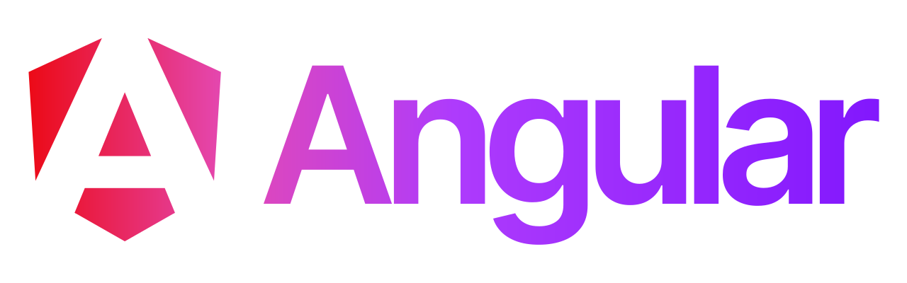

![Angular][angular-shield]
![TypeScript][typescript-shield]
![JavaScript][javascript-shield]
![Sass][sass-shield]
![CSS][css3-shield]
![HTML5][html5-shield]

:bangbang: Project available to access at: https://nitaicharan.github.io/Personal-Angular :bangbang:

<a href="https://nitaicharan.github.io/Personal-Angular">
  

    
  

</a>

## About project

This project is part of my personal study about the Angular framework for building scalable web apps with confidence.

## Contact

[![Gmail][gmail-shield]][gmail-url]
[![LinkedIn][linkedin-shield]][linkedin-url]
[![Github][github-shield]][github-url]

<!-- CONTACT SHIELDS -->

[linkedin-shield]: https://img.shields.io/badge/-LinkedIn-white.svg?logo=linkedin&colorB=0077B5&logoColor=white
[linkedin-url]: https://linkedin.com/in/nitaicharan/
[gmail-shield]: https://img.shields.io/badge/-Gmail-black.svg?logo=gmail&colorB=D14836&logoColor=white
[gmail-url]: mailto:niaicharan@gmail.com?subject=It%20comes%20from%20Github%20profile
[github-shield]: https://img.shields.io/badge/-Github-black.svg?logo=github&colorB=181717&logoColor=white
[github-url]: https://github.com/nitaicharan

<!-- PROJECT SHIELDS -->

[html5-shield]: https://img.shields.io/badge/-HTML5-black.svg?logo=html5&colorB=E34F26&logoColor=white
[css3-shield]: https://img.shields.io/badge/-CSS3-black.svg?logo=css3&colorB=1572B6&logoColor=white
[sass-shield]: https://img.shields.io/badge/-SASS-black.svg?logo=sass&colorB=CC6699&logoColor=white
[angular-shield]: https://img.shields.io/badge/-Angular-black.svg?logo=angular&colorB=DD0031&logoColor=white
[java-shield]: https://img.shields.io/badge/-Java-black.svg?logoColor=white&logo=java&&colorB=007396
[typescript-shield]: https://img.shields.io/badge/-TypeScript-black.svg?logoColor=white&logo=typescript&&colorB=007ACC
[javascript-shield]: https://img.shields.io/badge/-JavaScript-white.svg?logo=javascript&logoColor=black&colorB=F7DF1E
